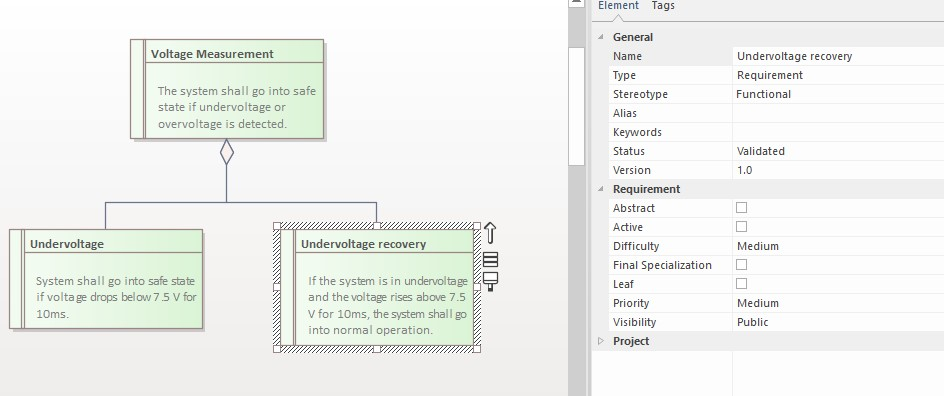
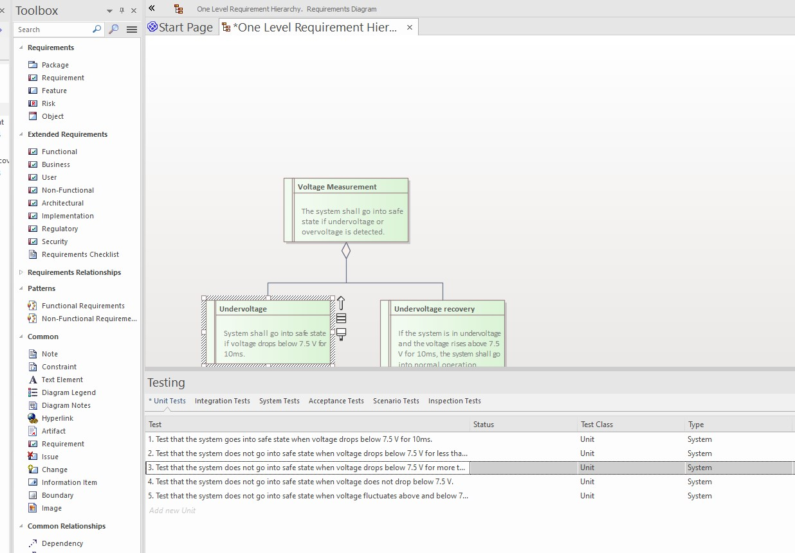

# Generates testcases from requirements using ChatGPT.

Python script that takes a requirement, sends it to Chat GPT and fills in the testcases returned by ChatGPT.

## Configuration:
- modify `API_KEY` in `req_to_testcase_gpt.py`. Mine is there, if you don't have one yet... so please don't spam it :)
- you can play in the script in the `chat_gpt` function with the `model` and `temperature` parameters to see what you obtain...

## Preconditions:
- Python (>3.7) installed
- Enterprise Architect installed
- Python dependecies installed (run `pip install -r requirements.txt` in the script folder)

## Steps to run:	
1. Open EA.
	
2. Select a requirement with the mouse. The element must be of "Requirement" type



3. Run the script by calling:
   ```
   python req_to_testcase_gpt.py
   ```
   Or run it in your favourite IDE (I use Visual Studio Code)

4. After `FINISHED!` is displayed in terminal, check the EA Requirements to see the testcases:



# Enjoy!